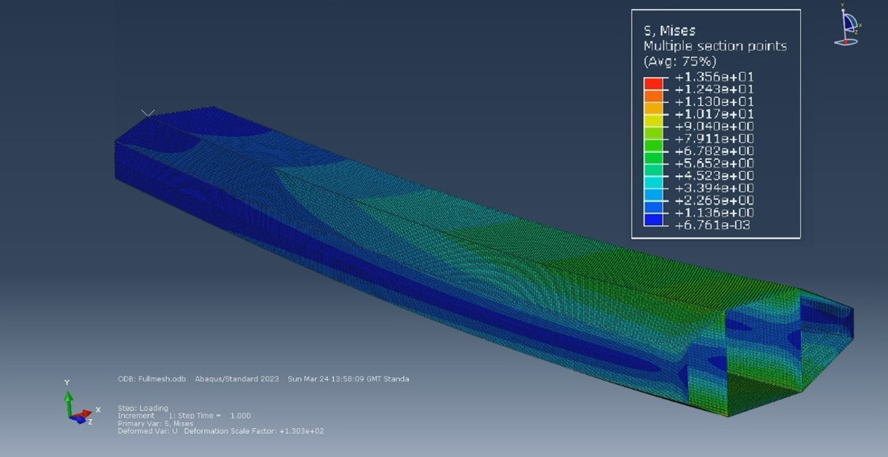
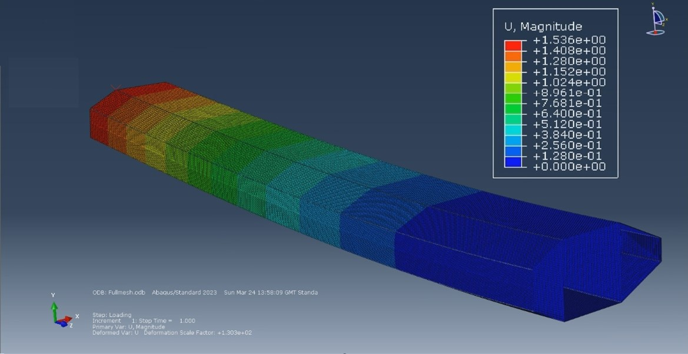

**Module Title**: Aircraft Structures | **Location**: London, UK | **Dates**: Oct 2023 - Dec 2023

The **Torsion in Multi-cell Box Beam** coursework was conducted as part of the EMS609 module to explore and compare shear flow and shear centre values derived from **hand calculations** and **Finite Element Method (FEM) simulations**. Using **Abaqus**, a three-dimensional **idealized wing box structure** was modelled and subjected to **boundary conditions** and a **point load**, simulating real-world torsional forces encountered in aircraft structures.

### Project Overview:

- **Structural Setup**: A multi-cell box beam structure was created using simplified schematic dimensions, representing a typical aircraft wing box. The structure was meshed and optimized for accuracy through convergence analysis, ensuring reliable results for subsequent simulations.

- **Analysis Methodology**:
    - **Finite Element Method (FEM) Simulation**: The structure was subjected to torsional loads in **Abaqus**, generating in-plane shear stresses (**S12**) across the beam. These stresses were then used to calculate **shear flow** and determine the location of the **shear centre**. The FEM analysis was performed under various loading conditions, visualizing the stress distribution and deformation of the beam.
    - **Hand Calculations**: Classical shear flow equations were used to calculate the same parameters by hand, applying **Bredt-Batho theory**. This allowed for a direct comparison between the analytical approach and the FEM results.

- **Key Findings**:
    - The **FEM simulation** provided a detailed view of the stress distribution, with shear flow and stress concentration visualizations highlighting critical areas within the multi-cell structure.
    - **Comparison**: Discrepancies between hand calculations and FEM results were observed, with **shear flow errors** ranging from **4.08% to 2289.66%**. The **shear centre** calculation error was lower, at around **4.06%**.
    - **Accuracy**: Overall, the FEM results proved more reliable for analyzing complex structures due to the reduced likelihood of human error and the ability to represent stresses with higher precision. This reinforces the utility of FEM in structural analysis, especially for complex geometries like multi-cell beams.

- **Visualization and Results**:
    - Below are images from the FEM simulation illustrating the **stress distribution**, and **deformation patterns** under torsion.
    - **Stress Visualization (S12)**:
      
    - **Displacement Visualization**:
      
    
    These images showcase the stress concentrations and the resulting displacement under applied torsional loads.

- **Report Deliverables**: A comprehensive report is being prepared, detailing the background theory of torsional mechanics, the modelling process in Abaqus, and an analysis of the comparative results between hand calculations and FEM simulations. The report will also discuss the sources of error and potential improvements in the simulation process.

### Learning Outcomes:
This project provided valuable insights into **torsional mechanics**, particularly the comparison between analytical methods and **numerical simulations** using FEM. The analysis enhanced my understanding of **shear flow** and **shear center** calculations in complex aerospace structures, while also refining my skills in **finite element analysis**.

**Key Skills Developed:**
- **Technical Skills**: Torsional Stress Analysis, Shear Flow Calculation, FEM Simulation, Abaqus, Structural Optimization, Bredt-Batho Theory.
- **Soft Skills**: Analytical Thinking, Report Writing, Problem Solving, Data Visualization, Structural Modeling.

[Full Report (PDF)](https://Joosty.github.io/files/Torsion_Box_Beam_Analysis_Report.pdf)
